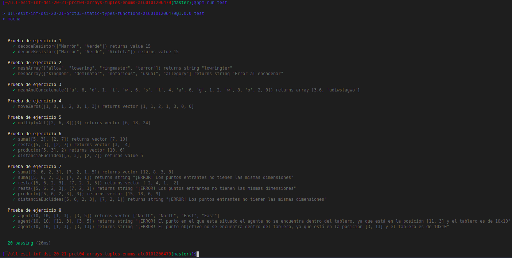

# Informe
## Práctica 4 - Arrays, tuplas y enumerados
### Desarrollo de Sistemas Informáticos
### ACOIDAN MESA HERNANDEZ - alu0101206479@ull.edu.es

#### Introducción
Esto es un informe para poder llevar a cabo la **práctica 4 de Desarrollo de Sistemas Informáticos**, hemos aprendido a crear una estructura de directorios adecuada (algo que ya sabíamos de la práctica anterior), pero añadiendole el uso del generador de documentación [TypeDoc](https://typedoc.org/) y el uso de [Mocha](https://mochajs.org/) (Marco de pruebas rico en funciones) con [Chai](https://www.chaijs.com/) (Librería de aserciones BDD / TDD para node y el navegador que se puede combinar con cualquier marco de pruebas JS o TS, en este caso lo hemos configurado con Mocha). 

A parte, como se ha llevado a cabo la metodología **TDD**, hemos reforzado nuestros conocimientos sobre ello. Y también hemos aprendido a utilizar **arrays, tuplas y enumerados** entre otras muchas herramientas. En este informe se mostrarán la resolución de los ejercicios y la explicación de estas soluciónes.


#### Objetivos
Los objetivos de esta práctica han sido crear la estructura de directorios adecuada para trabajar, añadiendole el generador de documentación TypeDoc y el uso del marco de pruebas Mocha con la libreria Chai. Pero lo principal ha sido resolver los 8 ejercicios que nos planteaban en el enunciado, para así familiarizarnos más profundamente con TypeScript, en concreto con los arrays, tuplas y enumerados.


#### Crear la estructura básica y adecuada del proyecto, añadiendole el generador de documentación TypeDoc y el uso del marco de pruebas Mocha con la librería Chai.
Para crear la [estructura básica del proyecto](https://ull-esit-inf-dsi-2021.github.io/typescript-theory/typescript-project-setup.html), lo haremos como lo hicimos en la práctica anterior (Estará el enlace al informe de esta en la bibliografía), también podemos pinchar el hiperenlace adjuntado que se encontrará disponible también en la bibliografía.

Posteriormente, para configurar y aprender a usar el generador de configuración [TypeDoc](https://typedoc.org/) y el marco de pruebas [Mocha](https://mochajs.org/) con la librería [Chai](https://www.chaijs.com/) podremos consultar la documentación o pinchar en los siguientes hiperenlaces a vídeos explicativos (Estos enlaces también se encuentran en la bibliografía):

  * [Vídeo de ejemplo de instalación y configuración de TypeDoc en un proyecto TypeScript](https://drive.google.com/file/d/19LLLCuWg7u0TjjKz9q8ZhOXgbrKtPUme/view)
  * [Vídeo de ejemplo de instalación y configuración de Mocha y Chai en un proyecto TypeScript](https://drive.google.com/file/d/1-z1oNOZP70WBDyhaaUijjHvFtqd6eAmJ/view?usp=sharing)

Finalmente, nos tiene que quedar algo parecido a lo siguiente (Se muestra a la izquierda la estructura y en el medio algunos archivos abiertos para que se vea su interior):


#### Ejercicios
En cuanto a los ejercicios que se mostrarán a continuación, podemos ver sus respectivos enunciados [en el enunciado de la práctica 4](https://ull-esit-inf-dsi-2021.github.io/prct04-arrays-tuples-enums/), los haremos todos en el directorio `/src` y haremos las respectivas pruebas en el directorio `/test`.


##### Ejercicio 1 - Decodificar resistencias
En este ejercicio se creará la función `decodeResistor(color: string[]): number | string`, la cual recibirá como parámetro los nombres de los colores de una resistencia y retornará un número de dos dígitos indicando el valor de la resistencia. 

Lo primero que se debe hacer en la función es crear el `array` con la codificación de los colores, en el cual cada color va a corresponder con el número de su posición. Por ejemplo, el negro corresponde con el 0 porque está en la posición 0 del `array`. Posteriormente crearemos la variable de salida y una variable contador, recorreremos con un `forEach` el `array` de entrada y dentro de este tendremos un condicional en el que se comprueba con el contador si hay más de 2 colores en el array de entrada. En ese caso se llegará hasta el segundo color introdujendo los correspondientes números en la salida y de ahí se ignorarán los demás. Dentro de dicho condicional con la función `indexOf` obtendremos los número de las posiciones de los colores busquemos, introduciremos este número en la variable de salida y cuando acabe el `forEach` dicha variable la pasaremos a número y se retornará.

El código del ejercicio sería el siguiente (/src/ejercicio-1.ts):

```typescript
/**
 * ```typescript
 * // Ejemplo de llamada
 *  decodeResistor(["Amarillo", "Marrón", "Verde"]  // Valor de retorno = 41
 * ```
 * Función para obtener el valor de una resistencia a partir de los colores
 * @param color Array que contiene los nombres de los colores de una resistencia
 * @return Un número de dos dígitos indicando el valor de la resistencia
 */
export function decodeResistor(color: string[]): number | string {
  const colores: string[] = ["Negro", "Marrón", "Rojo", "Naranja", "Amarillo", "Verde", "Azul", "Violeta", "Gris", "Blanco"];
  let salida: number | string = "";
  let count: number = 0;
  color.forEach((item) => {
    if (count < 2) {
      salida = salida + colores.indexOf(item).toString();
    }
    count++;
  });
  salida = parseInt(salida);
  return salida;
}
```

El test sería el siguiente (/tests/ejercicio-1.spec.ts):

```typescript
import 'mocha';
import {expect} from 'chai';
import {decodeResistor} from '../src/ejercicio-1';

describe('Prueba de ejercicio 1', () => {
  it('decodeResistor(["Marrón", "Verde"]) returns value 15', () => {
    expect(decodeResistor(["Marrón", "Verde"])).to.be.equal(15);
  });

  it('decodeResistor(["Marrón", "Verde", "Violeta"]) returns value 15', () => {
    expect(decodeResistor(["Marrón", "Verde", "Violeta"])).to.be.equal(15);
  });
});
```


##### Ejercicio 2 - Palabras encadenadas en un array
En este ejercicio se creará la función `meshArray(palabras: string[]): string`, la cual recibirá como parámetro un `array de string` con las palabras a comprobar. Se comprobará si las palabras estan encadenadas y en ese caso la función devolverá una cadena de texto que contenga las letras que encadenan las palabras del `array`, en caso contrario, la funcion retornará la cadena `"Error al encadenar"`.

Lo primero que se debe hacer en la función es crear las variables necesarias para el funcionamiento de esta. Entre dichas variables, es importante destacar las siguientes:
 * `posicionPp`: Con esta nos moveremos en la palabra que estemos analizando.
 * `posicionSp`: Con esta nos moveremos en la palabra que va después.
 * `contador`: Esta contará el número de veces que se retrocede en la palabra que se esta analizando.

Posteriormente utilizaremos un bucle `forEach` en el que recorremos el `array` de las palabras. En este, lo primero que haremos es inicializar las variables y después pondremos un bucle `while` en el que nos moveremos hasta encontrar el encadenamiento, a no ser que no haya, que en ese caso el `while` acabaría por la condición `posicionPp < item.length `. Posteriormente, se hará la comprobación en la que si la letra que se esta analizando en una palabra es igual a la letra que se esta analizando en la otra, se mira si las veces que se ha avanzado en la segunda palabra es igual al número de veces que se retrocedió en la primera, en ese caso, se introduce la letra en la variable `salidaAux` y se sale del `while` para avanzar a la siguiente palabra posteriormente. En otro caso se introduce la letra también en la variable `salidaAux`, pero también se avanza en la primera y en la segunda palabra y se sigue dentro del `while` para ver si siguen coincidiendo las letras.

Una vez que se sale del while se comprueba si las veces que se ha retrocedido en la palabra es menor a el número de letras que tiene la palabra, en ese caso, se introduce la información de variable `salidaAux` en la variable `salida` y en caso contrario significa que no hay encadenamiento, por lo que la variable `salida` tendrá el valor `"Error al encadenar"` y la variable `i` se pondrá a 100 (Un número lo suficientemente grande) para que no vuelva a entrar al bucle while en las siguientes palabras.

Una vez se sale del bucle `forEach` se retorna la variable `salida`, que contendrá en una cadena de texto las letras que encadenan las palabras del `array` en caso de que haya encadenamiento en todas las palabras. O contendrá la cadena `"Error al encadenar"` en caso de que no haya encadenamiento en alguna de las palabras.

El código del ejercicio sería el siguiente (/src/ejercicio-2.ts):

```typescript
/**
 * ```typescript
 * // Ejemplo de llamada
 *  meshArray(["allow", "lowering", "ringmaster", "terror"])  // Valor de retorno = "lowringter"
 *  meshArray(["kingdom", "dominator", "notorious", "usual", "allegory"]) // Valor de retorno = "Error al cadenar"
 * ```
 * Función para comprobar si las palabras de un array estan encadenadas o no
 * @param palabras Array que contiene las palabras a comprobar
 * @return "Error al encadenar" si las cadenas del array no estan encadenadas
 * @return "Una cadena de texto que contenga las letras que encandenan las palabras del array"
 */

export function meshArray(palabras: string[]): string {
  let posicionPp: number = 1;
  let posicionSp: number = 0;
  let contador:number = 0;
  let i: number = 0;
  let salidaAux: string = "";
  let salida: string = "";

  palabras.forEach((item) => {
    posicionPp = 1;
    posicionSp = 0;
    contador = 0;
    salidaAux = "";
    while (posicionPp < item.length && i+1 < palabras.length) {
      if (item[item.length-posicionPp] == palabras[i+1][posicionSp]) {
        if (posicionSp == contador) {
          salidaAux = salidaAux + item[item.length-posicionPp];
          break;
        } else {
          salidaAux = salidaAux + item[item.length-posicionPp];
          posicionPp--;
          posicionSp++;
        }
      } else {
        posicionPp++;
        contador++;
      }
    }

    if (posicionPp < item.length) {
      salida = salida + salidaAux;
      i++;
    } else {
      salida = "Error al encadenar";
      i = 100;
    }
  });

  return salida;
}

```

El test sería el siguiente (/tests/ejercicio-2.spec.ts):

```typescript
import 'mocha';
import {expect} from 'chai';
import {meshArray} from '../src/ejercicio-2';

describe('Prueba de ejercicio 2', () => {
  it('meshArray(["allow", "lowering", "ringmaster", "terror"]) returns string "lowringter"', () => {
    expect(meshArray(["allow", "lowering", "ringmaster", "terror"])).to.be.equal("lowringter");
  });

  it('meshArray(["kingdom", "dominator", "notorious", "usual", "allegory"] returns string "Error al encadenar"', () => {
    expect(meshArray(["kingdom", "dominator", "notorious", "usual", "allegory"])).to.be.equal("Error al encadenar");
  });
});

```


##### Ejercicio 3 - Calcular la media y concatenar cadenas
En este ejercicio crearemos la funcion `meanAndConcatenate(entrada: (number | string)[]): [number, string]`. A esta función le entra como parámetro un array de números y letras y retornará un array con dos valores (La media de los valores númericos como primer valor y una cadena resultaante de la concatenación de carácteres del array recibido como segundo valor).

En esta función lo primero que se hará es crear las variables necesarias para posteriormente a través de un bucle `forEach` ir moviendonos en el array de entrada. Dentro del bucle comprobamos con un guardian de tipo (`typeof`) si el elemento que estamos analizando es un número para, en ese caso incrementar el sumatorio de la media con el número que estemos analizando y a parte incrementar una variable que nos sirve para contar el número de elementos. En caso de que sea una letra lo que estamos analizando, la concatenamos a la variable `cadena`.

Posteiormente, cuando se acabe el bucle se dividirá el sumatorio de los números por la cantidad de números del array recibido para obtener la media. Y finalmente la función retorna un vector que tiene como primer valor dicha media y como segundo valor la cadena con las letras concatenadas.

El código del ejercicio sería el siguiente (/src/ejercicio-3.ts):

```typescript
/**
 * ```typescript
 * // Ejemplo de llamada
 *  meanAndConcatenate(['u', 6, 'd', 1, 'i', 'w', 6, 's', 't', 4, 'a', 6, 'g', 1, 2, 'w', 8, 'o', 2, 0]); // Valor de retorno = [3.6, 'udiwstagwo']
 * ```
 * Función que recibe números y letras en un array y devuelve la media de los números y las letras concadenadas en otro array
 * @param entrada Array que los números y las letras
 * @return Un array con dos valores (La media de los valores numéricos y una cadena resultado de la concatenación de carácteres del array recibido)
 */

export function meanAndConcatenate(entrada: (number | string)[]): [number, string] {
  let media: number = 0;
  let numNum: number = 0;
  let cadena: string = "";

  entrada.forEach((item) => {
    if (typeof item === "number") {
      media = media+item;
      numNum++;
    } else {
      cadena = cadena+item;
    }
  });

  media = media/numNum;

  return [media, cadena];
}
```

El test sería el siguiente (/tests/ejercicio-3.spec.ts):

```typescript
import 'mocha';
import {expect} from 'chai';
import {meanAndConcatenate} from '../src/ejercicio-3';

describe('Prueba de ejercicio 3', () => {
  it("meanAndConcatenate(['u', 6, 'd', 1, 'i', 'w', 6, 's', 't', 4, 'a', 6, 'g', 1, 2, 'w', 8, 'o', 2, 0]) returns array [3.6, 'udiwstagwo']", () => {
    expect(meanAndConcatenate(['u', 6, 'd', 1, 'i', 'w', 6, 's', 't', 4, 'a', 6, 'g', 1, 2, 'w', 8, 'o', 2, 0])).to.deep.equal([3.6, 'udiwstagwo']);
  });
});
```


##### Ejercicio 4 - Mover los ceros al final
En este ejercicio crearemos la funcion `moveZeros(entrada: (number)[]): (number)[]`. A esta función le entra como parámetro un `array` de números y retornará el mismo `array` con los numeros en el mismo orden pero los 0 desplazados al final del vector.

En esta función lo primero que se hará es crear las variables necesarias para posteriormente a través de un bucle `forEach` ir moviendonos en el `array` de entrada. Dentro del bucle lo primero que se hace es inicializamr la variable auxiliar `j` a la variable `i` para en todo momento estar en lo que estamos analizando. Posteriormente comprobamos si el dígito que estamos analizando es un 0 y en ese caso a través de la variable `j` y un bucle `while` lo moveremos hasta el final del `array` y incrementamos la variable `i`. En caso contrario simpemente incrementamos la variable `i` y pasamos a la siguiente iteración del bucle.

Finalmente la función retornará el vector de entrada pero con los 0 desplazados al final del vector.

El código del ejercicio sería el siguiente (/src/ejercicio-4.ts):

```typescript
/**
 * ```typescript
 * // Ejemplo de llamada
 *  moveZeros([1, 0, 1, 2, 0, 1, 3]; // Valor de retorno = [1, 1, 2, 1, 3, 0, 0]
 * ```
 * Función que recibe un array de numeros y los 0 los desplaza al final
 * @param entrada Array de numeros
 * @return Un array con los numeros en el mismo orden pero los 0 desplazados al final del vector
 */

export function moveZeros(entrada: (number)[]): (number)[] {
  let aux: number = 0;
  let i: number = 0;
  let j: number = 0;

  entrada.forEach((item) => {
    j = i;
    if (item == 0) {
      while (j+1 < entrada.length) {
        aux = entrada[j];
        entrada[j] = entrada[j+1];
        entrada[j+1] = aux;
        j++;
      }
      i++;
    } else {
      i++;
    }
  });

  return entrada;
}

```

El test sería el siguiente (/tests/ejercicio-4.spec.ts):

```typescript
import 'mocha';
import {expect} from 'chai';
import {moveZeros} from '../src/ejercicio-4';

describe('Prueba de ejercicio 4', () => {
  it('moveZeros([1, 0, 1, 2, 0, 1, 3]) returns vector [1, 1, 2, 1, 3, 0, 0]', () => {
    expect(moveZeros([1, 0, 1, 2, 0, 1, 3])).to.deep.equal([1, 1, 2, 1, 3, 0, 0]);
  });
});
```


##### Ejercicio 5 - Factoría de multiplicaciones
En este ejercicio se creará la función `multiplyAll(entrada: number[]): (multiplicador: number) => number[]`, la cual recibirá como parámetro un `array` de números y retornará otra función que tomará como argumento un único valor numérico y devolverá un nuevo array. Para ello en el `return` debemos de crear una función anónima que recibe como parámetro un valor númerico (Multiplicador) en la que lo primero que hacemos es definir el array que retornará esta función y posteriormente con un bucle `forEach` multiplicaremos cada número del `array` de entrada de la función principal por el multiplicador de entrada de la función anónima y este valor resultante se lo introduciremos al vector de salida a través de la función `push(item*multiplicador)`. Finalmente la función retorna el `array` de salida.

El código del ejercicio sería el siguiente (/src/ejercicio-5.ts):

```typescript
/**
 * ```typescript
 * // Ejemplo de llamada
 *  multiplyAll([2, 6, 8])(3); // Valor de retorno = [6, 18, 24]
 * ```
 * Función que recibe un array de numeros y devuelve una función que tiene como parámetro un número y devolverá un nuevo array que se obtiene del primer array multiplicado por este número
 * @param entrada Array de numeros
 * @return Una función que devuelve un nuevo array que se obtiene del array pasado por parámetro a la funcion principal multiplicado por este número
 */

export function multiplyAll(entrada: number[]): (multiplicador: number) => number[] {
  return (multiplicador: number) => {
    const salida: number[] = [];
    entrada.forEach((item) => {
      salida.push(item*multiplicador);
    });
    return salida;
  };
}
```

El test sería el siguiente (/tests/ejercicio-5.spec.ts):

```typescript
import 'mocha';
import {expect} from 'chai';
import {multiplyAll} from '../src/ejercicio-5';

describe('Prueba de ejercicio 5', () => {
  it('multiplyAll([2, 6, 8])(3) returns vector [6, 18, 24]', () => {
    expect(multiplyAll([2, 6, 8])(3)).to.deep.equal([6, 18, 24]);
  });
});
```


##### Ejercicio 6 - Puntos bi-dimensionales
En este ejercicio lo primero que haremos es crear el tipo `Point`, el cual representará puntos bi-dimensionales y que va a ser un vector de dos números (coordenada X y coordenada Y). Y posteriormente crearemos las siguientes funciones:

 * `suma(punto1: Point, punto2: Point): Point`: Función que recibe como parámetros dos puntos y finalmente retorna un nuevo punto resultante de la suma de estos dos. Para ello lo primero que se hace es que se crea el punto de salida. Posteriormente se asignará la coordenada x del punto de salida (Posición 0) a la suma de las coordenadas x de los dos puntos de entrada y se hará lo mismo con las coordenadas y (Posición 1). Finalmente la función retornará el punto resultante.

 * `resta(punto1: Point, punto2: Point): Point`: Función que recibe como parámetros dos puntos y finalmente retorna un nuevo punto resultante de la resta de estos dos. Para ello lo primero que se hace es que se crea el punto de salida. Posteriormente se asignará la coordenada x del punto de salida (Posición 0) a la resta de las coordenadas x de los dos puntos de entrada y se hará lo mismo con las coordenadas y. Finalmente la función retornará el punto resultante (Posición 1).

 * `producto(puntoE: Point, numero: number): Point`: Función que recibe como parámetros un punto y un número (el multiplicador) y devuelve un nuevo punto resultante de la multiplicación del punto de entrada por el número de entrada (multiplicador). Para ello lo primero que se hace es que se crea el punto de salida. Posteriormente se asignará la coordenada x del punto de salida (Posición 0) a la multiplicación de la coordenada x del punto de entrada por el multiplicador y haremos lo mismo con las coordenada y (Posición 1). Finalmente la función retornará el punto resultante.

 * `distanciaEuclidea(punto1: Point, punto2: Point): number`: Función que recibe como parámetros dos puntos y finalmente retorna la distancia Euclídea entre estos dos. Para ello lo primero que se hace es que se crea la variable `distanciaEuclidea`. Posteriormente se asignará su valor a la distancia Euclídea que se hará con la siguiente formula:

   
  
   De la cual la raíz cuadrada se calculará con la función `Math.sqrt` y las potencias con la función `Math.pow`. Finalmente se retornará la variable `distanciaEuclidea`.

El código del ejercicio sería el siguiente (/src/ejercicio-6.ts):

```typescript
type Point = [number, number];

/**
 * ```typescript
 * // Ejemplo de llamada
 *  suma([5, 3], [2, 7]); // Valor de retorno = [7, 10]
 * ```
 * Función que recibe dos puntos y devuelve un punto que es el resultado de la suma entre los dos entrantes
 * @param punto1 Primer punto
 * @param punto2 Segundo punto
 * @return Un punto resultante de la suma de los dos puntos entrantes
 */

export function suma(punto1: Point, punto2: Point): Point {
  const puntoS: Point = [0, 0];
  puntoS[0] = punto1[0] + punto2[0];
  puntoS[1] = punto1[1] + punto2[1];
  return puntoS;
}

/**
 * ```typescript
 * // Ejemplo de llamada
 *  resta([5, 3], [2, 7]); // Valor de retorno = [3, -4]
 * ```
 * Función que recibe dos puntos y devuelve un punto que es el resultado de la resta entre los dos entrantes
 * @param punto1 Primer punto
 * @param punto2 Segundo punto
 * @return Un punto resultante de la resta de los dos puntos entrantes
 */

export function resta(punto1: Point, punto2: Point): Point {
  const puntoS: Point = [0, 0];
  puntoS[0] = punto1[0] - punto2[0];
  puntoS[1] = punto1[1] - punto2[1];
  return puntoS;
}

/**
 * ```typescript
 * // Ejemplo de llamada
 *  producto([5, 3], 2); // Valor de retorno = [10, 6]
 * ```
 * Función que recibe como parámetros un punto y un número y devuelve un punto resultante de la multiplicación entre cada una de las coordenadas del punto entrante con el número entrante como segundo parámetro
 * @param puntoE Punto
 * @param numero Número por el que se multiplica
 * @return Un punto resultante de la multiplicación entre cada una de las coordenadas del punto entrante con el número entrante como segundo parámetro
 */

export function producto(puntoE: Point, numero: number): Point {
  const puntoS: Point = [0, 0];
  puntoS[0] = puntoE[0] * numero;
  puntoS[1] = puntoE[1] * numero;
  return puntoS;
}

/**
 * ```typescript
 * // Ejemplo de llamada
 *  distanciaEuclidea([5, 3], [2, 7]); // Valor de retorno = 5
 * ```
 * Función que recibe dos puntos y devuelve la distancia Euclídea entre estos dos
 * @param punto1 Primer punto
 * @param punto2 Segundo punto
 * @return La distancia Euclídea entre estos dos
 */

export function distanciaEuclidea(punto1: Point, punto2: Point): number {
  let distanciaEuclidea: number = 0;
  distanciaEuclidea = Math.sqrt(Math.pow(punto2[0] - punto1[0], 2) + Math.pow(punto2[1] - punto1[1], 2));
  return distanciaEuclidea;
}
```

El test sería el siguiente (/tests/ejercicio-6.spec.ts):

```typescript
import 'mocha';
import {expect} from 'chai';
import {suma} from '../src/ejercicio-6';
import {resta} from '../src/ejercicio-6';
import {producto} from '../src/ejercicio-6';
import {distanciaEuclidea} from '../src/ejercicio-6';

describe('Prueba de ejercicio 6', () => {
  it('suma([5, 3], [2, 7]) returns vector [7, 10]', () => {
    expect(suma([5, 3], [2, 7])).to.deep.equal([7, 10]);
  });

  it('resta([5, 3], [2, 7]) returns vector [3, -4]', () => {
    expect(resta([5, 3], [2, 7])).to.deep.equal([3, -4]);
  });

  it('producto([5, 3], 2) returns vector [10, 6]', () => {
    expect(producto([5, 3], 2)).to.deep.equal([10, 6]);
  });

  it('distanciaEuclidea([5, 3], [2, 7]) returns value 5', () => {
    expect(distanciaEuclidea([5, 3], [2, 7])).to.be.equal(5);
  });
});
```


##### Ejercicio 7 - Puntos n-dimensionales
En este ejercicio lo primero que haremos es crear el tipo `Point`, el cual representará puntos de 3 o más dimensiones y que va a ser un vector de al menos tres números. Y posteriormente crearemos las siguientes funciones:

 * `suma(punto1: Point, punto2: Point): Point | String`: Función que recibe como parámetros dos puntos y finalmente retorna un nuevo punto resultante de la suma de estos dos. Para ello lo primero que se hará es comprobar que los dos puntos tienen el mismo número de dimensiones, si no es así la función retornará la cadena de error `"¡ERROR! Los puntos entrantes no tienen las mismas dimensiones"`. Y en el caso que los dos puntos tengan las mismas dimensiones se creará el punto de salida y una variable `i` que servirá para movernos en el segundo punto. Posteriormente a través de un bucle `forEach` nos moveremos en las dimensiones del primer punto y le asignaremos a la dimensión correspondiente del punto de salida la suma de las dimensiones correspondientes de los dos puntos de entrada, posteriormente incrementaremos la i y pasaremos de iteración en iteración repitiendo el proceso. Finalmente la función retornará el punto resultante.

 * `resta(punto1: Point, punto2: Point): Point | String`: Función que recibe como parámetros dos puntos y finalmente retorna un nuevo punto resultante de la resta de estos dos. Para ello lo primero que se hará es comprobar que los dos puntos tienen el mismo número de dimensiones, si no es así la función retornará la cadena de error `"¡ERROR! Los puntos entrantes no tienen las mismas dimensiones"`. Y en el caso que los dos puntos tengan las mismas dimensiones se creará el punto de salida y una variable `i` que servirá para movernos en el segundo punto. Posteriormente a través de un bucle `forEach` nos moveremos en las dimensiones del primer punto y le asignaremos a la dimensión correspondiente del punto de salida la resta de las dimensiones correspondientes de los dos puntos de entrada, posteriormente incrementaremos la i y pasaremos de iteración en iteración repitiendo el proceso. Finalmente la función retornará el punto resultante.

 * `producto(puntoE: Point, numero: number): Point`: Función que recibe como parámetros un punto y un número (el multiplicador) y devuelve un nuevo punto resultante de la multiplicación del punto de entrada por el número de entrada (multiplicador). Para ello lo primero que se hace es que se crea el punto de salida y la variable `i` que servirá de iterador. Posteriormente a través de un bucle `forEach` se le asignará al valor de cada dimensión del punto de salida, el valor de la multiplicación de dicha dimensión por el multiplicador, y se incrementará la `i`. Finalmente la función retornará el punto resultante.

 * `distanciaEuclidea(punto1: Point, punto2: Point): number`: Función que recibe como parámetros dos puntos y finalmente retorna la distancia Euclídea entre estos dos. Para ello lo primero que se hará es comprobar que los dos puntos tienen el mismo número de dimensiones, si no es así la función retornará la cadena de error `"¡ERROR! Los puntos entrantes no tienen las mismas dimensiones"`. Y en el caso que los dos puntos tengan las mismas dimensiones se creará la variable `distanciaEuclidea` y una variable `i` que servirá para movernos en el segundo punto. Posteriormente se asignará el valor de la variable `distanciaEuclidea` a la distancia Euclídea que se hará con la siguiente formula:

   
   
   De la cual la raíz cuadrada se calculará con la función `Math.sqrt` y las potencias con la función `Math.pow`. Como no sabemos el número de dimensiones que tienen los puntos de entradas, a través de un bucle `forEach` se irá haciendo el sumatorio de la función. Finalmente se retornará la variable `distanciaEuclidea`.
   
El código del ejercicio sería el siguiente (/src/ejercicio-7.ts):

```typescript
type Point = [number, number, number, ...number[]];

/**
 * ```typescript
 * // Ejemplos de llamadas
 *  suma([5, 6, 2, 3], [7, 2, 1, 5]); // Valor de retorno = [12, 8, 3, 8]
 *  suma([5, 6, 2, 3], [7, 2, 1]); // Valor de retorno = "¡ERROR! Los puntos entrantes no tienen las mismas dimensiones", si los puntos no tienen la misma dimensión
 * ```
 * Función que recibe dos puntos y devuelve un punto que es el resultado de la suma entre los dos entrantes si tienen la misma dimensión, si no, devuelve la cadena "¡ERROR! Los puntos entrantes no tienen las mismas dimensiones"
 * @param punto1 Primer punto
 * @param punto2 Segundo punto
 * @return Un punto resultante de la suma de los dos puntos entrantes si estos tienen la misma dimensión o la cadena "¡ERROR! Los puntos entrantes no tienen las mismas dimensiones"
 */

export function suma(punto1: Point, punto2: Point): Point | String {
  if (punto1.length == punto2.length) {
    const puntoS: Point = [0, 0, 0];
    let i: number = 0;

    punto1.forEach((item) => {
      puntoS[i] = item + punto2[i];
      i++;
    });

    return puntoS;
  } else {
    return "¡ERROR! Los puntos entrantes no tienen las mismas dimensiones";
  }
}

/**
 * ```typescript
 * // Ejemplo de llamada
 *  resta([5, 6, 2, 3], [7, 2, 1, 5]); // Valor de retorno = [-2, 4, 1, -2]
 *  resta([5, 6, 2, 3], [7, 2, 1]); // Valor de retorno = "¡ERROR! Los puntos entrantes no tienen las mismas dimensiones"
 * ```
 * Función que recibe dos puntos y devuelve un punto que es el resultado de la resta entre los dos entrantes si tienen la misma dimensión, si no, devuelve la cadena "¡ERROR! Los puntos entrantes no tienen las mismas dimensiones"
 * @param punto1 Primer punto
 * @param punto2 Segundo punto
 * @return Un punto resultante de la resta de los dos puntos entrantes si estos tienen la misma dimensión o la cadena "¡ERROR! Los puntos entrantes no tienen las mismas dimensiones", si los puntos no tienen la misma dimensión
 */

export function resta(punto1: Point, punto2: Point): Point | string {
  if (punto1.length == punto2.length) {
    const puntoS: Point = [0, 0, 0];
    let i: number = 0;

    punto1.forEach((item) => {
      puntoS[i] = item - punto2[i];
      i++;
    });

    return puntoS;
  } else {
    return "¡ERROR! Los puntos entrantes no tienen las mismas dimensiones";
  }
}

/**
 * ```typescript
 * // Ejemplo de llamada
 *  producto([5, 6, 2, 3], 3); // Valor de retorno = [15, 18, 6, 9]
 * ```
 * Función que recibe como parámetros un punto y un número y devuelve un punto resultante de la multiplicación entre cada una de las coordenadas del punto entrante con el número entrante como segundo parámetro
 * @param puntoE Punto
 * @param numero Número por el que se multiplica
 * @return Un punto resultante de la multiplicación entre cada una de las coordenadas del punto entrante con el número entrante como segundo parámetro
 */

export function producto(puntoE: Point, numero: number): Point {
  const puntoS: Point = [0, 0, 0];
  let i: number = 0;

  puntoE.forEach((item) => {
    puntoS[i] = item*numero;
    i++;
  });

  return puntoS;
}

/**
 * ```typescript
 * // Ejemplo de llamada
 *  distanciaEuclidea([5, 6, 2, 3], [7, 2, 1, 5]); // Valor de retorno = 2
 *  distanciaEuclidea([5, 6, 2, 3], [7, 2, 1]); // Valor de retorno = "¡ERROR! Los puntos entrantes no tienen las mismas dimensiones"
 * ```
 * Función que recibe dos puntos y devuelve la distancia Euclídea entre estos dos, si tienen la misma dimensión, si no, devuelve la cadena "¡ERROR! Los puntos entrantes no tienen las mismas dimensiones"
 * @param punto1 Primer punto
 * @param punto2 Segundo punto
 * @return La distancia Euclídea entre estos dos si estos tienen la misma dimensión o la cadena "¡ERROR! Los puntos entrantes no tienen las mismas dimensiones", si los puntos no tienen la misma dimensión
 */

export function distanciaEuclidea(punto1: Point, punto2: Point): number | string {
  if (punto1.length == punto2.length) {
    let distanciaEuclidea: number = 0;
    let i: number = 0;

    punto1.forEach((item) => {
      distanciaEuclidea = Math.pow(punto2[i] - item, 2);
      i++;
    });

    distanciaEuclidea = Math.sqrt(distanciaEuclidea);
    return distanciaEuclidea;
  } else {
    return "¡ERROR! Los puntos entrantes no tienen las mismas dimensiones";
  }
}
```

El test sería el siguiente (/tests/ejercicio-7.spec.ts):

```typescript
import 'mocha';
import {expect} from 'chai';
import {suma} from '../src/ejercicio-7';
import {resta} from '../src/ejercicio-7';
import {producto} from '../src/ejercicio-7';
import {distanciaEuclidea} from '../src/ejercicio-7';

describe('Prueba de ejercicio 7', () => {
  it('suma([5, 6, 2, 3], [7, 2, 1, 5]) returns vector [12, 8, 3, 8]', () => {
    expect(suma([5, 6, 2, 3], [7, 2, 1, 5])).to.deep.equal([12, 8, 3, 8]);
  });

  it('suma([5, 6, 2, 3], [7, 2, 1]) returns string "¡ERROR! Los puntos entrantes no tienen las mismas dimensiones"', () => {
    expect(suma([5, 6, 2, 3], [7, 2, 1])).to.be.equal("¡ERROR! Los puntos entrantes no tienen las mismas dimensiones");
  });

  it('resta([5, 6, 2, 3], [7, 2, 1, 5]) returns vector [-2, 4, 1, -2]', () => {
    expect(resta([5, 6, 2, 3], [7, 2, 1, 5])).to.deep.equal([-2, 4, 1, -2]);
  });

  it('resta([5, 6, 2, 3], [7, 2, 1]) returns string "¡ERROR! Los puntos entrantes no tienen las mismas dimensiones"', () => {
    expect(resta([5, 6, 2, 3], [7, 2, 1])).to.be.equal("¡ERROR! Los puntos entrantes no tienen las mismas dimensiones");
  });

  it('producto([5, 6, 2, 3], 3); returns vector [15, 18, 6, 9]', () => {
    expect(producto([5, 6, 2, 3], 3)).to.deep.equal([15, 18, 6, 9]);
  });

  it('distanciaEuclidea([5, 6, 2, 3], [7, 2, 1]) returns string "¡ERROR! Los puntos entrantes no tienen las mismas dimensiones"', () => {
    expect(distanciaEuclidea([5, 6, 2, 3], [7, 2, 1])).to.be.equal("¡ERROR! Los puntos entrantes no tienen las mismas dimensiones");
  });
});

```


##### Ejercicio 8 - El agente
En este ejercicio se creará por un lado el tipo `Point` que representa una posición en el tablero y que es un vector de dos números (Coordenada x y coordenada y). Y por otro lado se creará la función `agent(x: number, y: number, initialPoint: Point, endPoint: Point): string | string[]`, la cual recibirá como parámetro número de filas del tablero, el número de columnas del tablero, la posición inicial del agente y la posición objetivo a la que el agente tiene que llegar. Y retornará cadenas de error si los puntos de inicio o objetivo están fuera del tablero, o un vector con los movimientos que tiene que hacer el agente para llegar de la posición de inicio a la posición objetivo si estas están dentro del tablero. 

Para ello lo primero que haremos es comprobar si el posición de inicio del agente está dentro del tablero, si no lo está se retorna la cadena ``¡ERROR! El punto en el que esta situado el agente no se encuentra dentro del tablero, ya que está en la posición [${initialPoint[0]}, ${initialPoint[1]}] y el tablero es de ${x}x${y}``. Posteriormente se comprueba si la posición objetivo está dentro del tablero y si no lo está la función retorna la cadena ``¡ERROR! El punto objetivo no se encuentra dentro del tablero, ya que está en la posición [${endPoint[0]}, ${endPoint[1]}] y el tablero es de ${x}x${y}``. Si las dos posiciones estan dentro del tablero, continúa el código con normalidad.

Después a través de un bucle `while` y de condicionales `if` se comprueba si la posición objetivo esta por encima o por debajo de la posición de inicio. Si está por encima, se incrementa la coordenada y (Posición 1) de la posición de inicio y se introduce en el `array` de salida la palabra `"North"` ya que nos estaríamos moviendo para el norte del tablero. Pero si está por debajo, se decrementa la coordenada y (Posición 1) de la posición de inicio y se introduce en el `array` de salida la palabra `"South"` ya que nos estaríamos moviendo para el sur del tablero. Esto se repite hasta que la posición del agente esté a la misma altura en el tablero que la posición objetivo.

Posteriormente a través de otro bucle `while` y de condicionales `if` se comprueba si la posición objetivo esta a la derecha o a la izquierda de la posición de inicio. Si está a la derecha, se incrementa la coordenada x (Posición 0) de la posición de inicio y se introduce en el `array` de salida la palabra `"East"` ya que nos estaríamos moviendo para el este del tablero. Pero si está a la izquierda, se decrementa la coordenada x (Posición 0) de la posición de inicio y se introduce en el `array` de salida la palabra `"West"` ya que nos estaríamos moviendo para el oeste del tablero. Esto se repite hasta que la posición del agente esté en la misma columna en el tablero que la posición objetivo.

Finalmente ya estaría el agente en la posición objetivo por lo que la función retorna el vector de movimiendos.

El código del ejercicio sería el siguiente (/src/ejercicio-8.ts):

```typescript
type Point = [number, number];

/**
 * ```typescript
 * // Ejemplos de llamadas
 *  agent(10, 10, [1, 3], [3, 5]);  // Valor de retorno = ["North", "North", "East", "East"]
 *  agent(10, 10, [11, 3], [3, 5]); // Valor de retorno = "¡ERROR! El punto en el que esta situado el agente no se encuentra dentro del tablero, ya que está en la posición [11, 3] y el tablero es de 10x10"
 *  agent(10, 10, [1, 3], [3, 13]); // Valor de retorno = "¡ERROR! El punto objetivo no se encuentra dentro del tablero, ya que está en la posición [3, 13] y el tablero es de 10x10"
 *  ```
 * Función que recibe las dimensiones de un tablero, la posicion de inicio de un agente y la posición objetivo. La función retornará un vector con los movimientos que tiene que tomar el agente para llegar al objetivo, si las posiciones están dentro del tablero, o retornará cadenas de error si no lo están.
 * @param x Número de filas del tablero
 * @param y Número de columnas del tablero
 * @param initialPoint Posición inicial del agente
 * @param endPoint Posicion objetivo a la que el agente tiene que llegar
 * @return Un vector con los movimientos que tiene que tomar el agente para llegar al objetivo, si las posiciones de inicio y objetivo del agente estan dentro del tablero. Si la posicion de inicio no lo está la función retornará la cadena "¡ERROR! El punto en el que esta situado el agente no se encuentra dentro del tablero, ya que está en la posición [${initialPoint[0]}, ${initialPoint[1]}] y el tablero es de ${x}x${y}" y si la posición objetivo no lo está la función retornará la cadena "¡ERROR! El punto objetivo no se encuentra dentro del tablero, ya que está en la posición [${endPoint[0]}, ${endPoint[1]}] y el tablero es de ${x}x${y}".
 */

export function agent(x: number, y: number, initialPoint: Point, endPoint: Point): string | string[] {
  const salida: string[] = [];

  if (initialPoint[0] > x || initialPoint[1] > y) {
    return `¡ERROR! El punto en el que esta situado el agente no se encuentra dentro del tablero, ya que está en la posición [${initialPoint[0]}, ${initialPoint[1]}] y el tablero es de ${x}x${y}`;
  }

  if (endPoint[0] > x || endPoint[1] > y) {
    return `¡ERROR! El punto objetivo no se encuentra dentro del tablero, ya que está en la posición [${endPoint[0]}, ${endPoint[1]}] y el tablero es de ${x}x${y}`;
  }

  while (initialPoint[1] != endPoint[1]) {
    if (initialPoint[1] > endPoint[1]) {
      salida.push("South");
      initialPoint[1]--;
    }
    if (initialPoint[1] < endPoint[1]) {
      salida.push("North");
      initialPoint[1]++;
    }
  }

  while (initialPoint[0] != endPoint[0]) {
    if (initialPoint[0] < endPoint[0]) {
      salida.push("East");
      initialPoint[0]++;
    }
    if (initialPoint[0] > endPoint[0]) {
      salida.push("West");
      initialPoint[0]--;
    }
  }

  return salida;
}
```

El test sería el siguiente (/tests/ejercicio-8.spec.ts):

```typescript
import 'mocha';
import {expect} from 'chai';
import {agent} from '../src/ejercicio-8';

describe('Prueba de ejercicio 8', () => {
  it('agent(10, 10, [1, 3], [3, 5]) returns vector ["North", "North", "East", "East"]', () => {
    expect(agent(10, 10, [1, 3], [3, 5])).to.deep.equal(["North", "North", "East", "East"]);
  });

  it('agent(10, 10, [11, 3], [3, 5]) returns string "¡ERROR! El punto en el que esta situado el agente no se encuentra dentro del tablero, ya que está en la posición [11, 3] y el tablero es de 10x10"', () => {
    expect(agent(10, 10, [11, 3], [3, 5])).to.deep.equal("¡ERROR! El punto en el que esta situado el agente no se encuentra dentro del tablero, ya que está en la posición [11, 3] y el tablero es de 10x10");
  });

  it('agent(10, 10, [1, 3], [3, 13]) returns string "¡ERROR! El punto objetivo no se encuentra dentro del tablero, ya que está en la posición [3, 13] y el tablero es de 10x10"', () => {
    expect(agent(10, 10, [1, 3], [3, 13])).to.deep.equal("¡ERROR! El punto objetivo no se encuentra dentro del tablero, ya que está en la posición [3, 13] y el tablero es de 10x10");
  });
});
```


#### Tests
Si se ha seguido esta guía copiando todos los códigos y los tests finalmente al ejecutar la instrucción `npm run test` tendríamos que tener la siguiente salida:

 


#### Conclusiones
Como conclusión a la práctica, me ha parecido bastante útil el aprender a usar herramientas como el generador de documentación TypeDoc, ya que a través de esta se crea una pagina web con la documentación de tu código organizada. Otra herramienta importante a destacar tambien es el Mocha con el uso de Chai, ya que poder tener organizadas las pruebas de tu código es increíble y super cómodo

Los ejercicios me han parecido entretenidos y no tan díficiles de elaborar, por lo que me quedo satisfecho con mi trabajo realizado en ellos.


#### Bibliografía

Nombre | Enlaces
-------|--------
Enunciado de la práctica | https://ull-esit-inf-dsi-2021.github.io/prct04-arrays-tuples-enums/
Apuntes de la asignatura | https://ull-esit-inf-dsi-2021.github.io/typescript-theory/
TypeDoc | https://typedoc.org/
Mocha | https://mochajs.org/
Chai | https://www.chaijs.com/
Tutorial de creación de la estructura básica del proyecto | https://ull-esit-inf-dsi-2021.github.io/typescript-theory/typescript-project-setup.html
Vídeo de ejemplo de instalación y configuración de TypeDoc en un proyecto TypeScript | https://drive.google.com/file/d/19LLLCuWg7u0TjjKz9q8ZhOXgbrKtPUme/view
Repositorio GitHub con el ejemplo de configuración de TypeDoc en un proyecto TypeScript | https://github.com/ULL-ESIT-INF-DSI-2021/doc-test
Vídeo de ejemplo de instalación y configuración de Mocha y Chai en un proyecto TypeScript | https://drive.google.com/file/d/1-z1oNOZP70WBDyhaaUijjHvFtqd6eAmJ/view
Repositorio GitHub con el ejemplo de configuración de Mocha y Chai en un proyecto TypeScript | https://github.com/ULL-ESIT-INF-DSI-2021/doc-test
