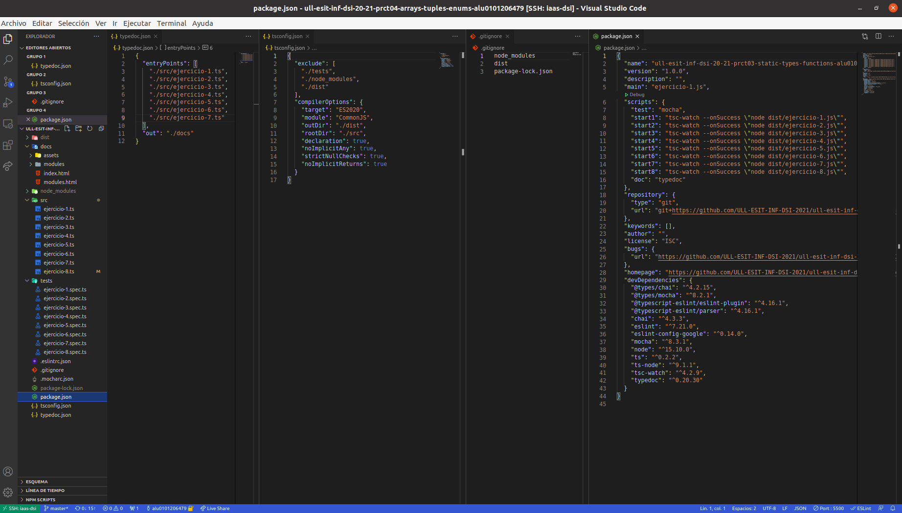

# Informe
## Práctica 4 - Arrays, tuplas y enumerados
### Desarrollo de Sistemas Informáticos
### ACOIDAN MESA HERNANDEZ - alu0101206479@ull.edu.es

#### Introducción
Esto es un informe para poder llevar a cabo la **práctica 4 de Desarrollo de Sistemas Informáticos**, hemos aprendido a crear una estructura de directorios adecuada (algo que ya sabíamos de la práctica anterior), pero añadiendole el uso del generador de documentación [TypeDoc](https://typedoc.org/) y el uso de [Mocha](https://mochajs.org/) (Marco de pruebas rico en funciones) con [Chai](https://www.chaijs.com/) (Librería de aserciones BDD / TDD para node y el navegador que se puede combinar con cualquier marco de pruebas JS o TS, en este caso lo hemos configurado con Mocha). 

A parte, como se ha llevado a cabo la metodología **TDD**, hemos reforzado nuestros conocimientos sobre ello. Y también hemos aprendido a utilizar **arrays, tuplas y enumerados** entre otras muchas herramientas. En este informe se mostrarán la resolución de los ejercicios y la explicación de estas soluciónes.


#### Objetivos
Los objetivos de esta práctica han sido crear la estructura de directorios adecuada para trabajar, añadiendole el generador de documentación TypeDoc y el uso del marco de pruebas Mocha con la libreria Chai. Pero lo principal ha sido resolver los 8 ejercicios que nos planteaban en el enunciado, para así familiarizarnos más profundamente con TypeScript, en concreto con los arrays, tuplas y enumerados.


#### Crear la estructura básica y adecuada del proyecto, añadiendole el generador de documentación TypeDoc y el uso del marco de pruebas Mocha con la librería Chai.
Para crear la [estructura básica del proyecto](https://ull-esit-inf-dsi-2021.github.io/typescript-theory/typescript-project-setup.html), lo haremos como lo hicimos en la práctica anterior (Estará el enlace al informe de esta en la bibliografía), también podemos pinchar el hiperenlace adjuntado que se encontrará disponible también en la bibliografía.

Posteriormente, para configurar y aprender a usar el generador de configuración [TypeDoc](https://typedoc.org/) y el marco de pruebas [Mocha](https://mochajs.org/) con la librería [Chai](https://www.chaijs.com/) podremos consultar la documentación o pinchar en los siguientes hiperenlaces a vídeos explicativos (Estos enlaces también se encuentran en la bibliografía):

  * [Vídeo de ejemplo de instalación y configuración de TypeDoc en un proyecto TypeScript](https://drive.google.com/file/d/19LLLCuWg7u0TjjKz9q8ZhOXgbrKtPUme/view)
  * [Vídeo de ejemplo de instalación y configuración de Mocha y Chai en un proyecto TypeScript](https://drive.google.com/file/d/1-z1oNOZP70WBDyhaaUijjHvFtqd6eAmJ/view?usp=sharing)

Finalmente, nos tiene que quedar algo parecido a lo siguiente (Se muestra a la izquierda la estructura y en el medio algunos archivos abiertos para que se vea su interior):




#### Ejercicios
En cuanto a los ejercicios que se mostrarán a continuación, podemos ver sus respectivos enunciados [en el enunciado de la práctica 4](https://ull-esit-inf-dsi-2021.github.io/prct04-arrays-tuples-enums/), los haremos todos en el directorio `/src` y haremos las respectivas pruebas en el directorio `/test`.

##### Ejercicio 1 - Decodificar resistencias
En este ejercicio se creará la función `function decodeResistor(color: string[]): number | string`, la cual recibirá como parámetro los nombres de los colores de una resistencia y retornará un número de dos dígitos indicando el valor de la resistencia. 

Lo primero que se debe hacer en la función es crear el `array` con la codificación de los colores, en el cual cada color va a corresponder con el número de su posición. Por ejemplo, el negro corresponde con el 0 porque está en la posición 0 del `array`. Posteriormente crearemos la variable de salida y una variable contador, recorreremos con un `forEach` el `array` de entrada y dentro de este tendremos un condicional en el que se comprueba con el contador si hay más de 2 colores en el array de entrada. En ese caso se llegará hasta el segundo color introdujendo los correspondientes números en la salida y de ahí se ignorarán los demás. Dentro de dicho condicional con la función `indexOf` obtendremos los número de las posiciones de los colores busquemos, introduciremos este número en la variable de salida y cuando acabe el `forEach` dicha variable la pasaremos a número y se retornará.

El código del ejercicio sería el siguiente (/src/ejercicio-1.ts):

```typescript
/**
 * ```typescript
 * // Ejemplo de llamada
 *  decodeResistor(["Amarillo", "Marrón", "Verde"]  // Valor de retorno = 41
 * ```
 * Función para obtener el valor de una resistencia a partir de los colores
 * @param color Array que contiene los nombres de los colores de una resistencia
 * @return Un número de dos dígitos indicando el valor de la resistencia
 */
export function decodeResistor(color: string[]): number | string {
  const colores: string[] = ["Negro", "Marrón", "Rojo", "Naranja", "Amarillo", "Verde", "Azul", "Violeta", "Gris", "Blanco"];
  let salida: number | string = "";
  let count: number = 0;
  color.forEach((item) => {
    if (count < 2) {
      salida = salida + colores.indexOf(item).toString();
    }
    count++;
  });
  salida = parseInt(salida);
  return salida;
}
```

El test sería el siguiente (/tests/ejercicio-1.spec.ts):

```typescript
import 'mocha';
import {expect} from 'chai';
import {decodeResistor} from '../src/ejercicio-1';

describe('Prueba de ejercicio 1', () => {
  it('decodeResistor(["Marrón", "Verde"]) returns value 15', () => {
    expect(decodeResistor(["Marrón", "Verde"])).to.be.equal(15);
  });

  it('decodeResistor(["Marrón", "Verde", "Violeta"]) returns value 15', () => {
    expect(decodeResistor(["Marrón", "Verde", "Violeta"])).to.be.equal(15);
  });
});
```


##### Ejercicio 2 - Palabras encadenadas en un array
En este ejercicio se creará la función `function meshArray(palabras: string[]): string`, la cual recibirá como parámetro un `array de string` con las palabras a comprobar. Se comprobará si las palabras estan encadenadas y en ese caso la función devolverá una cadena de texto que contenga las letras que encadenan las palabras del `array`, en caso contrario, la funcion retornará la cadena `"Error al encadenar"`.

Lo primero que se debe hacer en la función es crear las variables necesarias para el funcionamiento de esta. Entre dichas variables, es importante destacar las siguientes:
 * `posicionPp`: Con esta nos moveremos en la palabra que estemos analizando.
 * `posicionSp`: Con esta nos moveremos en la palabra que va después.
 * `contador`: Esta contará el número de veces que se retrocede en la palabra que se esta analizando.

Posteriormente utilizaremos un bucle `forEach` en el que recorremos el `array` de las palabras. En este, lo primero que haremos es inicializar las variables y después pondremos un bucle `while` en el que nos moveremos hasta encontrar el encadenamiento, a no ser que no haya, que en ese caso el `while` acabaría por la condición `posicionPp < item.length `. Posteriormente, se hará la comprobación en la que si la letra que se esta analizando en una palabra es igual a la letra que se esta analizando en la otra, se mira si las veces que se ha avanzado en la segunda palabra es igual al número de veces que se retrocedió en la primera, en ese caso, se introduce la letra en la variable `salidaAux` y se sale del `while` para avanzar a la siguiente palabra posteriormente. En otro caso se introduce la letra también en la variable `salidaAux`, pero también se avanza en la primera y en la segunda palabra y se sigue dentro del `while` para ver si siguen coincidiendo las letras.

Una vez que se sale del while se comprueba si las veces que se ha retrocedido en la palabra es menor a el número de letras que tiene la palabra, en ese caso, se introduce la información de variable `salidaAux` en la variable `salida` y en caso contrario significa que no hay encadenamiento, por lo que la variable `salida` tendrá el valor `"Error al encadenar"` y la variable `i` se pondrá a 100 (Un número lo suficientemente grande) para que no vuelva a entrar al bucle while en las siguientes palabras.

Una vez se sale del bucle `forEach` se retorna la variable `salida`, que contendrá en una cadena de texto las letras que encadenan las palabras del `array` en caso de que haya encadenamiento en todas las palabras. O contendrá la cadena `"Error al encadenar"` en caso de que no haya encadenamiento en alguna de las palabras.


El código del ejercicio sería el siguiente (/src/ejercicio-2.ts):

```typescript
/**
 * ```typescript
 * // Ejemplo de llamada
 *  meshArray(["allow", "lowering", "ringmaster", "terror"])  // Valor de retorno = "lowringter"
 *  meshArray(["kingdom", "dominator", "notorious", "usual", "allegory"]) // Valor de retorno = "Error al cadenar"
 * ```
 * Función para comprobar si las palabras de un array estan encadenadas o no
 * @param palabras Array que contiene las palabras a comprobar
 * @return "Error al encadenar" si las cadenas del array no estan encadenadas
 * @return "Una cadena de texto que contenga las letras que encandenan las palabras del array"
 */

export function meshArray(palabras: string[]): string {
  let posicionPp: number = 1;
  let posicionSp: number = 0;
  let contador:number = 0;
  let i: number = 0;
  let salidaAux: string = "";
  let salida: string = "";

  palabras.forEach((item) => {
    posicionPp = 1;
    posicionSp = 0;
    contador = 0;
    salidaAux = "";
    while (posicionPp < item.length && i+1 < palabras.length) {
      if (item[item.length-posicionPp] == palabras[i+1][posicionSp]) {
        if (posicionSp == contador) {
          salidaAux = salidaAux + item[item.length-posicionPp];
          break;
        } else {
          salidaAux = salidaAux + item[item.length-posicionPp];
          posicionPp--;
          posicionSp++;
        }
      } else {
        posicionPp++;
        contador++;
      }
    }

    if (posicionPp < item.length) {
      salida = salida + salidaAux;
      i++;
    } else {
      salida = "Error al encadenar";
      i = 100;
    }
  });

  return salida;
}

```

El test sería el siguiente (/tests/ejercicio-2.spec.ts)::

```typescript
import 'mocha';
import {expect} from 'chai';
import {meshArray} from '../src/ejercicio-2';

describe('Prueba de ejercicio 2', () => {
  it('meshArray(["allow", "lowering", "ringmaster", "terror"]) returns string "lowringter"', () => {
    expect(meshArray(["allow", "lowering", "ringmaster", "terror"])).to.be.equal("lowringter");
  });

  it('meshArray(["kingdom", "dominator", "notorious", "usual", "allegory"] returns string "Error al encadenar"', () => {
    expect(meshArray(["kingdom", "dominator", "notorious", "usual", "allegory"])).to.be.equal("Error al encadenar");
  });
});

```


##### Ejercicio 3 - Validador de mensajes
En este ejercicio crearemos la funcion `isValid(cadena: string): boolean` para comprobar si un mensaje es válido según diversas condiciones. A esta función le entra como parámetro una cadena de texto y retorna true o false dependiendo si la cadena es válida o no respectivamente.

En esta función lo primero que se hará es crear las variables necesarias para posteriormente a través de un bucle `for` ir moviendonos por los números de la cadena, ya que las letras las vamos a comprobar dentro del último bucle `while` que se encuentra.

Dentro del bucle `for` inicializamos las variables y posteriormente a través de una `expresión regular` y un bucle `while` iremos leyendo el número en el que estemos situados para más tarde poder contar el número de letras que tienen que venir a continuación, se utiliza un bucle while porque el número puede tener más de una cifra, también se avanza la `i` para ir moviendonos en la cadena.

Más adelate pasamos el número sacado de la cadena a número entero para después poder realizar comprobaciones. Y también podemos observar otro bucle `while` el cual contará el número de letras que haya hasta encontrar un número (se irá avanzando la i).

Y finalmente se realiza una comprobación en la que si el número que cogimos de la cadena es igual al contador de las letras que vinieron despues de este, continua a la siguiente iteración (La cual empezaría en el siguiente número de la cadena). Pero si es igual, la función retornaría false ya que la cadena no sería válida. Si acaba el for y no se ha retornado false, la cadena sería válida y se retornaría true.

El código del ejercicio sería el siguiente:

```typescript
  function isValid(cadena: string): boolean {
    let digitos: string = '';
    let numero: number = 0;
    let contador: number = 0;

    for (let i: number = 0; i < cadena.length; i = i) {
      digitos = '';
      numero = 0;
      contador = 0;
      while (/\d/.test(cadena[i])) {
        digitos = digitos + cadena[i];
        i = i+1;
      }
      numero = parseInt(digitos);
      while (!(/\d/.test(cadena[i])) && i < cadena.length) {
        contador++;
        i = i+1;
      }

      if (numero == contador) {
        continue;
      } else {
        return false;
      }
    }
    return true;
  }

  let mensaje: string = "";
  let funcionEj3: boolean = isValid(mensaje);
  console.log(`\nEl mensaje "${mensaje}" es valido: ${funcionEj3}`);

  mensaje = "3hey5hello2hi";
  funcionEj3 = isValid(mensaje);
  console.log(`\nEl mensaje "${mensaje}" es valido: ${funcionEj3}`);

  mensaje = "4code10helloworld";
  funcionEj3 = isValid(mensaje);
  console.log(`\nEl mensaje "${mensaje}" es valido: ${funcionEj3}`);

  mensaje = "4coe10helloworld";
  funcionEj3 = isValid(mensaje);
  console.log(`\nEl mensaje "${mensaje}" es valido: ${funcionEj3}`);

  mensaje = "4code10helloorld";
  funcionEj3 = isValid(mensaje);
  console.log(`\nEl mensaje "${mensaje}" es valido: ${funcionEj3}`);
```

Salida del código:


##### Ejercicio 4 - Conversor de estilo
En este ejercicio dispondremos de las siguientes dos funciones:

  * Función `fromSnakeToCamelCase(snakeCase: string): string`: Esta función recibe como parámetro una cadena en formato snakeCase (Con palabras separadas por barrabaja) y devuelve como resultado la cadena en formato camelCase (Con palabras separadas por la primera letra mayúscula de cada palabra a partir de la segunda palabra). Para ello se utiliza una variable denominada `camelCase` que en principio esta vacía y es donde se almacenará la cadena en el nuevo formato. Se utiliza un bucle `for` en el que se avanza en la cadena y se va comprobando en cada caracter si se encuentra una barrabaja. Mientras no se encuentre se va a ir introduciendo cada caracter de la cadena anterior en la variable creada y cuando se encuentre se va a ignorar y se va a introducir la letra que viene después en mayúscula (Esto se hace con la funcion `toUpperCase()`), a parte también se va a incrementar la `i`. Finalmente cuando se acabe el bucle `for` se retorna la cadena resultante.

 * Función `fromCamelToSnakeCase(camelCase: string): string`: Esta función recibe como parámetro una cadena en formato camelCase (Con palabras separadas por la primera letra mayúscula de cada palabra a partir de la segunda palabra) y devuelve como resultado la cadena en formato snakeCase (Con palabras separadas por barrabaja). Para ello se utiliza una variable denominada `snakeCase` que en principio esta vacía y es donde se almacenará la cadena en el nuevo formato. Se utiliza un bucle `for` en el que se avanza en la cadena y se va comprobando en cada caracter si se encuentra una letra mayúscula. Mientras no se encuentre se va a ir introduciendo cada caracter de la cadena anterior en la variable creada y cuando se encuentre se va a introducir una barrabaja seguida de la letra que se esta analizando en minúscula (Esto se hace con la funcion `toLowerCase()`). Finalmente cuando se acabe el bucle `for` se retorna la cadena resultante.

El código del ejercicio sería el siguiente:

```typescript
  function fromSnakeToCamelCase(snakeCase: string): string {
    let camelCase: string = '';
    for (let i: number = 0; i < snakeCase.length; i++) {
      if (snakeCase[i] == "_") {
        camelCase = camelCase + snakeCase.charAt(i+1).toUpperCase();
        i++;
      } else {
        camelCase = camelCase + snakeCase[i];
      }
    }
    return camelCase;
  }

  function fromCamelToSnakeCase(camelCase: string): string {
    let snakeCase: string = '';
    for (let i: number = 0; i < camelCase.length; i++) {
      if (camelCase[i] == camelCase.charAt(i).toUpperCase()) {
        snakeCase = snakeCase + "_" + camelCase.charAt(i).toLowerCase();
      } else {
        snakeCase = snakeCase + camelCase[i];
      }
    }
    return snakeCase;
  }

  let nombre: string = "sample_string";
  let funcionEj4: string = fromSnakeToCamelCase(nombre);
  console.log(`\nEl nombre en formato Snake Case "${nombre}", en formato Camel Case sería: ${funcionEj4}`);

  nombre = "the_stealth_warrior";
  funcionEj4 = fromSnakeToCamelCase(nombre);
  console.log(`\nEl nombre en formato Snake Case "${nombre}", en formato Camel Case sería: ${funcionEj4}`);

  nombre = "sampleString";
  funcionEj4 = fromCamelToSnakeCase(nombre);
  console.log(`\nEl nombre en formato Camel Case "${nombre}", en formato Snake Case sería: ${funcionEj4}`);

  nombre = "theStealthWarrior";
  funcionEj4 = fromCamelToSnakeCase(nombre);
  console.log(`\nEl nombre en formato Camel Case "${nombre}", en formato Snake Case sería: ${funcionEj4}`);
```

Salida del código:


##### Ejercicio 5 - Un solo golpe
En este ejercicio se creará la función `onePunch(cadena: string): string`, la cual recibirá como parámetro una cadena de texto y si esta es vacía devolverá la cadena "Broken!", pero si no lo es devolverá la cadena ordenada, sin las "a" y si las "e". Para ello lo primero que se realiza es comprobar si la cadena de entrada es vacía y si lo es retornar la cadena correspondiente. Pero si no lo es lo que se hace es que la cadena se separa en palabras a través de la función `split(" ")`, se ordena alfabéticamente a través de la función `sort()`, se vuelve a unir con espacios entre medio a través de la función `join(" ")`, se quitan las "a" y las "e" a través de la función `replace(/[ae]/g, "")`, en la cual utilizamos una `expresión regular`. Y finalmente se retorna la cadena.

El código del ejercicio sería el siguiente:

```typescript
  function onePunch(cadena: string): string {
    if (cadena == "") {
      return "Broken!";
    }

    cadena = cadena.split(" ").sort().join(" ").replace(/[ae]/g, "");

    return cadena;
  }

  console.log(`\nDespués de separar, ordenar, unir las cadenas de nuevo y eliminar todas las apariciones de las letras a y e, las cadenas quedarian de la siguiente manera: `);

  let cadena: string = "Beard Jeans Hairbrush Knuckleduster Sand";
  let funcionEj5: string = onePunch(cadena);
  console.log(`\n'${cadena}' => '${funcionEj5}'`);

  cadena = "Sock Beard Vest Lady Sage";
  funcionEj5 = onePunch(cadena);
  console.log(`'${cadena}' => '${funcionEj5}'`);

  cadena = "Beard Sack Gun Parachute Face-Kicking-Shoes";
  funcionEj5 = onePunch(cadena);
  console.log(`'${cadena}' => '${funcionEj5}'`);

  cadena = "Snot Snow Soda Tank Beard";
  funcionEj5 = onePunch(cadena);
  console.log(`'${cadena}' => '${funcionEj5}'`);

  cadena = "";
  funcionEj5 = onePunch(cadena);
  console.log(`'${cadena}' => '${funcionEj5}'`);
```

Salida del código:


##### Ejercicio 6 - Conversor ISBN
En este ejercicio se creará la función `isValidISBN(isbn: string): boolean`, la cual recibirá como parámetro una cadena de texto que representará un ISBN y devolverá como resultado true o false dependiendo si el resultado es válido o no, respectivamente. Para ello lo primero que se hace es que a través de la función `replace(/[-]/g, "")` (La cual utiliza una `expresión regular`) quitaremos los guiones de la cadena por si acaso el ISBN se haya pasado con los números separados por guiones.

Posteriormente declararemos la variable `sumatorio` que esta inicializada a cero en la que después a través de un bucle `for` en el cual avanzamos en la cadena, se irá almacenando el sumatorio de la siguiente formula (La cual determina que el ISBN sea válido o no):

`(x1 * 10 + x2 * 9 + x3 * 8 + x4 * 7 + x5 * 6 + x6 * 5 + x7 * 4 + x8 * 3 + x9 * 2 + x10 * 1) mod 11 == 0`

Para ello, en el bucle `for` se va analizando posición a posición y se comprueba si 
en la cadena la letra "X" ya que esta representa un 10 y se multiplicaría por el número correspondiente. Si no se encuentra una X, se va a pasar el número que se encuentra en la cadena a número entero y se va a multiplicar por el número correspondiente. Todo esto se ira sumando en cada iteración.

Finalmente, despues de acabar el bucle, se comprueba si el sumatorio que se ha sacado es divisible por 11 y si lo es, el ISBN sería valido y la función retornaría true. Pero si no lo es, no sería válido y la función retornaría false.

El código del ejercicio sería el siguiente:

```typescript
  function isValidISBN(isbn: string): boolean {
    isbn = isbn.replace(/[-]/g, "");
    if (isbn.length < 10) {
      return false;
    }
    let sumatorio: number = 0;

    for (let i = 0; i<isbn.length; i++) {
      if (isbn[i] == "X") {
        sumatorio = sumatorio + (10 * (isbn.length-i));
      } else {
        sumatorio = sumatorio + (parseInt(isbn[i]) * (isbn.length-i));
      }
    }

    if (sumatorio%11 == 0) {
      return true;
    } else {
      return false;
    }
  }

  let isbn: string = "3-598-21508-8";
  let funcionEj6 = isValidISBN(isbn);
  console.log(`\nEl ISBN "${isbn}" es válido: ${funcionEj6}`);

  isbn = "3598215088";
  funcionEj6 = isValidISBN(isbn);
  console.log(`\nEl ISBN "${isbn}" es válido: ${funcionEj6}`);

  isbn = "3-598-21507-X";
  funcionEj6 = isValidISBN(isbn);
  console.log(`\nEl ISBN "${isbn}" es válido: ${funcionEj6}`);

  isbn = "359821507X";
  funcionEj6 = isValidISBN(isbn);
  console.log(`\nEl ISBN "${isbn}" es válido: ${funcionEj6}`);

  isbn = "35-98-285";
  funcionEj6 = isValidISBN(isbn);
  console.log(`\nEl ISBN "${isbn}" es válido: ${funcionEj6}`);

  isbn = "3598215086";
  funcionEj6 = isValidISBN(isbn);
  console.log(`\nEl ISBN "${isbn}" es válido: ${funcionEj6}`);
```

Salida del código:


##### Ejercicio 7 - El siguiente número
En este ejercicio se creará la función `siguienteNumero(numero: number): number`, la cual recibirá como parámetro un entero positivo y devolverá el siguiente número mayor que pueda ser formado al reposicionar sus dígitos. Para ello lo primero que se hace es crear la variable `numText` que almacenará el `number` que entra a la función en `string` a través de la función `toFixed()`, esto se hace para poder ir analizando los dígitos del número entre sí e ir sustituyéndolos. También se crea una variable auxiliar que servirá para almacenar contenido posteriormente. 

Lo siguiente que se hará es crear un bucle `for` en el que nos movemos desde el final del número hasta el principio y otro bucle for en el que nos movemos al revés (desde el principio hasta el final). Lo que hacemos es que el dígito que estemos analizando (Empezando por el de la derecha) lo comparamos con el de su izquierda y lo vamos intercambiando si es menor o igual que este, hasta que encontremos uno que es mayor, que se intercambiaría y la función retornaría el número nuevo. Hariamos esto susesivamente moviéndonos por los digitos del número si no encontramos uno mayor.

Si nunca se encuentra un dígito mayor por el que intercambiar después de revisar todos los digitos del número, la función retornará -1.

El código del ejercicio sería el siguiente:

```typescript
  function siguienteNumero(numero: number): number {
    let numText: string = numero.toFixed();
    let aux: string = "";
    for (let i: number = numText.length-1; i > -1; i--) {
      for (let j: number = 0; j < numText.length; j++) {
        if (i-j > 0) {
          if (parseInt(numText[i - j]) <= parseInt(numText[i-j-1])) {
            aux = numText[i-j];
            numText = numText.substr(0, i-j-1) + aux +
            numText[i-j-1] + numText.substr(i-j+1, numText.length);
          } else {
            aux = numText[i-j];
            numText = numText.substr(0, i-j-1) + aux +
            numText[i-j-1] + numText.substr(i-j+1, numText.length);
            return parseInt(numText);
          }
        }
      }
      numText = numero.toFixed();
    }
    return -1;
  }

  console.log(`\nNúmero -> Siguiente número mayor: `);

  let numeroEj7: number = 1275;
  let funcionEj7: number = siguienteNumero(numeroEj7);
  console.log(`\n${numeroEj7} -> ${funcionEj7}`);

  numeroEj7 = 12;
  funcionEj7 = siguienteNumero(numeroEj7);
  console.log(`${numeroEj7} -> ${funcionEj7}`);

  numeroEj7 = 513;
  funcionEj7 = siguienteNumero(numeroEj7);
  console.log(`${numeroEj7} -> ${funcionEj7}`);

  numeroEj7 = 2017;
  funcionEj7 = siguienteNumero(numeroEj7);
  console.log(`${numeroEj7} -> ${funcionEj7}`);

  numeroEj7 = 9;
  funcionEj7 = siguienteNumero(numeroEj7);
  console.log(`${numeroEj7} -> ${funcionEj7}`);

  numeroEj7 = 111;
  funcionEj7 = siguienteNumero(numeroEj7);
  console.log(`${numeroEj7} -> ${funcionEj7}`);

  numeroEj7 = 531;
  funcionEj7 = siguienteNumero(numeroEj7);
  console.log(`${numeroEj7} -> ${funcionEj7}`);
```

Salida del código:


##### Ejercicio 8 - Contando IPs
En este ejercicio se creará la función `ipsInRange(ip1: string, ip2: string): number`, la cual recibirá como parámetro dos cadenas que representan las IPs y devuelve un valor numérico que represente el número de IPs disponibles en el rango correspondiente. Para ello lo primero que haremos en la función es crear dos constantes tipo string que almacenarán cada número de las IPs (serían 4 en total), también crearemos la variable `rango` que será la que contenga el rango de direcciones y la vairable `n` que nos servirá como variable auxiliar.

Posteriormente haremos un bucle `for` que servirá para movernos en los números de las IPs de derecha a izquiera y hacer el sumatorio de sus respectivas restas multiplicadas por n (n que cada vez que nos movamos a la izquierda va a multiplicar su valor por 256, que va a ser el rango de direcciones disponibles entre cada valor de la resta).

Finalmente la función retornará el rango de direcciones obtenido del bucle.

El código del ejercicio sería el siguiente:

```typescript
  function ipsInRange(ip1: string, ip2: string): number {
    const ip1Numbers: string[] = ip1.split(".");
    const ip2Numbers: string[] = ip2.split(".");
    let rango: number = 0;
    let n: number = 1;

    for (let i = ip1Numbers.length-1; i > -1; i--) {
      rango = rango + (parseInt(ip2Numbers[i])-parseInt(ip1Numbers[i])) * n;
      n = n*256;
    }
    return rango;
  }

  console.log("\nRangos IPs == IPs disponibles en ese rango:");

  let ip1: string = "10.0.0.0";
  let ip2: string = "10.2.0.0";
  let funcionEj8 = ipsInRange(ip1, ip2);
  console.log(`\n${ip1}, ${ip2} == ${funcionEj8}`);

  ip1 = "10.0.0.0";
  ip2 = "10.0.1.0";
  funcionEj8 = ipsInRange(ip1, ip2);
  console.log(`${ip1}, ${ip2} == ${funcionEj8}`);

  ip1 = "20.0.0.10";
  ip2 = "20.0.1.0";
  funcionEj8 = ipsInRange(ip1, ip2);
  console.log(`${ip1}, ${ip2} == ${funcionEj8}`);
```

Salida del código:


##### Ejercicio 9 - Entrenador Pokemon
En este ejercicio se creará la función `dañoPokemon(tipoPokemon1: string, tipoPokemon2: string, ataque1: number, defensa2: number)`, la cual recibirá como parámetro el tipo de Pokemon que tiene, el tipo de Pokemon de su oponente, su capacidad de ataque y la capacidad de defensa de su oponente. La función devolverá como resultado el daño causado. 

Esto se basará en la siguiente formula, donde `ataque` es tu capacidad de ataque, `defensa` es la capacidad de defensa del oponente y la efectividad del ataque varía dependiendo de los tipos de pokemon que esten batallando (se puede ver en el enunciado de la práctica):
```daño = 50 * (ataque / defensa) * efectividad```

Lo primero que debemos hacer en la función es crear las variables `efectividad` (almacenará la efectividad) y `daño`, será la variable que se retorne y contendrá el daño después de realizar la formula.

Posteriormente haremos las comprobaciones necesarias de los tipos de los Pokemons para darle el valor correspondiente a la efectividad, esto lo haremos con un `if` indicando que si son del mismo tipo la efectividad será 0.5 y si no lo son, se hará un switch para comprobar los distintos casos posibles y darle el valor correspondiente a la efectividad. Después de esto, se realizará la formula ya que tendremos todos los valores que necesitamos para obtener el daño y se retornará.

El código del ejercicio sería el siguiente:

```typescript
  function dañoPokemon(tipoPokemon1: string, tipoPokemon2: string, ataque1: number, defensa2: number) {
    let efectividad: number = 0;
    let daño: number = 0;

    if (tipoPokemon1 == tipoPokemon2) {
      efectividad = 0.5;
    } else {
      switch (tipoPokemon1) {
        case "fuego":
          if (tipoPokemon2 == "hierba") {
            efectividad = 2;
          }
          if (tipoPokemon2 == "eléctrico") {
            efectividad = 1;
          }
          if (tipoPokemon2 == "agua") {
            efectividad = 0.5;
          }
          break;

        case "hierba":
          if (tipoPokemon2 == "agua") {
            efectividad = 2;
          }
          if (tipoPokemon2 == "eléctrico") {
            efectividad = 1;
          }
          if (tipoPokemon2 == "fuego") {
            efectividad = 0.5;
          }
          break;

        case "eléctrico":
          if (tipoPokemon2 == "agua") {
            efectividad = 2;
          }
          if ((tipoPokemon2 == "fuego") || (tipoPokemon2 == "hierba")) {
            efectividad = 1;
          }
          break;

        case "agua":
          if (tipoPokemon2 == "fuego") {
            efectividad = 2;
          } else {
            efectividad = 0.5;
          }
          break;
      }
    }

    daño = 50 * (ataque1 / defensa2) * efectividad;
    return daño;
  }

  let tipoPokemon1 = "fuego";
  let tipoPokemon2 = "hierba";
  let ataque = 4;
  let defensa = 3;
  let funcionEj9 = dañoPokemon(tipoPokemon1, tipoPokemon2, ataque, defensa);
  console.log(`\nTipo pokemon atacante: ${tipoPokemon1}, tipo pokemon defensor: ${tipoPokemon2}, ataque: ${ataque}, defensa: ${defensa}:`);
  console.log(`\tDaño del ataque: ${funcionEj9}`);

  tipoPokemon1 = "fuego";
  tipoPokemon2 = "agua";
  ataque = 3;
  defensa = 7;
  funcionEj9 = dañoPokemon(tipoPokemon1, tipoPokemon2, ataque, defensa);
  console.log(`\nTipo pokemon atacante: ${tipoPokemon1}, tipo pokemon defensor: ${tipoPokemon2}, ataque: ${ataque}, defensa: ${defensa}:`);
  console.log(`\tDaño del ataque: ${funcionEj9}`);

  tipoPokemon1 = "fuego";
  tipoPokemon2 = "eléctrico";
  ataque = 8;
  defensa = 6;
  funcionEj9 = dañoPokemon(tipoPokemon1, tipoPokemon2, ataque, defensa);
  console.log(`\nTipo pokemon atacante: ${tipoPokemon1}, tipo pokemon defensor: ${tipoPokemon2}, ataque: ${ataque}, defensa: ${defensa}:`);
  console.log(`\tDaño del ataque: ${funcionEj9}`);

  tipoPokemon1 = "agua";
  tipoPokemon2 = "hierba";
  ataque = 2;
  defensa = 7;
  funcionEj9 = dañoPokemon(tipoPokemon1, tipoPokemon2, ataque, defensa);
  console.log(`\nTipo pokemon atacante: ${tipoPokemon1}, tipo pokemon defensor: ${tipoPokemon2}, ataque: ${ataque}, defensa: ${defensa}:`);
  console.log(`\tDaño del ataque: ${funcionEj9}`);

  tipoPokemon1 = "agua";
  tipoPokemon2 = "eléctrico";
  ataque = 9;
  defensa = 5;
  funcionEj9 = dañoPokemon(tipoPokemon1, tipoPokemon2, ataque, defensa);
  console.log(`\nTipo pokemon atacante: ${tipoPokemon1}, tipo pokemon defensor: ${tipoPokemon2}, ataque: ${ataque}, defensa: ${defensa}:`);
  console.log(`\tDaño del ataque: ${funcionEj9}`);

  tipoPokemon1 = "hierba";
  tipoPokemon2 = "eléctrico";
  ataque = 7;
  defensa = 7;
  funcionEj9 = dañoPokemon(tipoPokemon1, tipoPokemon2, ataque, defensa);
  console.log(`\nTipo pokemon atacante: ${tipoPokemon1}, tipo pokemon defensor: ${tipoPokemon2}, ataque: ${ataque}, defensa: ${defensa}:`);
  console.log(`\tDaño del ataque: ${funcionEj9}`);

  tipoPokemon1 = "fuego";
  tipoPokemon2 = "fuego";
  ataque = 2;
  defensa = 1;
  funcionEj9 = dañoPokemon(tipoPokemon1, tipoPokemon2, ataque, defensa);
  console.log(`\nTipo pokemon atacante: ${tipoPokemon1}, tipo pokemon defensor: ${tipoPokemon2}, ataque: ${ataque}, defensa: ${defensa}:`);
  console.log(`\tDaño del ataque: ${funcionEj9}`);
```

Salida del código:


##### Ejercicio 10 - Validador de nombre usuario
En este ejercicio se creará la función `isValidUsername(usuario: string): boolean`, la cual recibirá como parámetro una cadena con un nombre de usuario y devolverá true o false dependiendo si el nombre es válido o no lo es, respectivamente. 

Para ello, realizaremos diversas comprobaciones a traves de condicionales `if`, si alguna no se cumple la función retorna false, entre ellas:

  1. El nombre de usuario tiene al menos 4 caracteres y no más de 30.
  2. El nombre de usuario no empieza y no termina con un guión bajo.
  3. El nombre de usuario contiene al menos una letra mayúscula, una letra minúscula, un número y algún símbolo especial ($,-,_).
  4. El nombre de usuario no tiene un mismo tipo de carácter más de dos veces.

Si se han pasado todas las comproaciones sin que se retorne false, la función retorna true.

El código del ejercicio sería el siguiente:

```typescript
  function isValidUsername(usuario: string): boolean {
    if (usuario.length < 4 || usuario.length > 30) {
      return false;
    }

    if (usuario[0] == "_" || usuario[usuario.length-1] == "_") {
      return false;
    }

    if (!(/[A-Z]/.test(usuario)) ||
     !(/[a-z]/.test(usuario)) ||
      !(/[0-9]/.test(usuario)) ||
        !(/[$_-]/.test(usuario))) {
      return false;
    }

    if ((/[A-Z][A-Z][A-Z]/.test(usuario)) ||
      (/[a-z][a-z][a-z]/.test(usuario)) ||
        (/[0-9][0-9][0-9]/.test(usuario)) ||
          (/[$_-][$_-][$_-]/.test(usuario))) {
      return false;
    }

    return true;
  }

  let usuario: string = "u__hello$122__";
  let funcionEj10: boolean = isValidUsername(usuario);
  console.log(`\nEl nombre de usuario "${usuario}" es válido: ${funcionEj10}`);

  usuario = "Aho$12_B";
  funcionEj10 = isValidUsername(usuario);
  console.log(`\nEl nombre de usuario "${usuario}" es válido: ${funcionEj10}`);

  usuario = "_Aho12_B";
  funcionEj10 = isValidUsername(usuario);
  console.log(`\nEl nombre de usuario "${usuario}" es válido: ${funcionEj10}`);

  usuario = "Ac_12";
  funcionEj10 = isValidUsername(usuario);
  console.log(`\nEl nombre de usuario "${usuario}" es válido: ${funcionEj10}`);
```

Salida del código:


#### Conclusiones
Como conclusión a la práctica, me ha parecido bastante entretenida e interesante la labor de hacer los ejercicios, ya que he aprendido a usar expresiones regulares en programación, a crear la estructura de directorios adecuada y a configurar las dependencias.

Poco a poco con las prácticas me estoy dando cuenta de que cuanto más me familiarizo con TypeScript más me gusta y me parece un lenguaje bastante interesante.


#### Bibliografía

Nombre | Enlaces
-------|--------
Enunciado de la práctica | https://ull-esit-inf-dsi-2021.github.io/prct03-types-functions/
Tutorial sobre los métodos que puede utilizar con `string` | https://www.w3schools.com/js/js_string_methods.asp
Expresiones regulares en JavaScript | https://www.w3schools.com/js/js_regexp.asp
Tutorial de creación de la estructura básica del proyecto | https://ull-esit-inf-dsi-2021.github.io/typescript-theory/typescript-project-setup.html
Sistema factorial | https://es.wikipedia.org/wiki/Factor%C3%A1dico
Proceso de verificación ISBN-10 | https://en.wikipedia.org/wiki/International_Standard_Book_Number
